# PSoC&trade; 4: MSCLP low power CSX slider

This code example demonstrates how to use the CAPSENSE&trade; middleware to detect a finger touch on a mutual-capacitance-based slider widget in PSoC&trade; 4000T device with multi-sense converter low-power (MSCLP).

In addition, this code example also explains how to manually tune the mutual-capacitance-based slider for optimum performance with respect to parameters such as reliability, power consumption, and response time using the CSX-RM sensing technique and CAPSENSE&trade; tuner GUI. Here, CAPSENSE&trade; CSX represents the mutual-capacitance sensing technique, and RM represents the ratiometric method.

[View this README on GitHub.](https://github.com/Infineon/mtb-example-psoc4-msclp-low-power-csx-slider)

[Provide feedback on this code example.](https://cypress.co1.qualtrics.com/jfe/form/SV_1NTns53sK2yiljn?Q_EED=eyJVbmlxdWUgRG9jIElkIjoiQ0UyMzg4MTkiLCJTcGVjIE51bWJlciI6IjAwMi0zODgxOSIsIkRvYyBUaXRsZSI6IlBTb0MmdHJhZGU7IDQ6IE1TQ0xQIGxvdyBwb3dlciBDU1ggc2xpZGVyIiwicmlkIjoieWFzaHZpIiwiRG9jIHZlcnNpb24iOiIxLjAuMCIsIkRvYyBMYW5ndWFnZSI6IkVuZ2xpc2giLCJEb2MgRGl2aXNpb24iOiJNQ0QiLCJEb2MgQlUiOiJJQ1ciLCJEb2MgRmFtaWx5IjoiUFNPQyJ9)


## Requirements

- [ModusToolbox&trade; software](https://www.infineon.com/cms/en/design-support/tools/sdk/modustoolbox-software/) v3.1 or later

 >  **Note:** This code example version requires ModusToolbox&trade; software version 3.1 or later and is not backward compatible with v3.0 or older versions.

- Board support package (BSP) minimum required version: 3.1.0
- Programming language: C
- Associated parts: [PSoC&trade; 4000T](www.infineon.com/002-33949)

## Supported toolchains (make variable 'TOOLCHAIN')

- GNU Arm&reg; Embedded Compiler v11.3.1 (`GCC_ARM`) – Default value of `TOOLCHAIN`
- Arm&reg; Compiler v6.16 (`ARM`)
- IAR C/C++ Compiler v9.30.1 (`IAR`)

## Supported kits (make variable 'TARGET')

- [PSoC&trade; 4000T CAPSENSE&trade; Prototyping Kit](https://www.infineon.com/CY8CPROTO-040T) (`CY8CPROTO-040T`) - Default `TARGET`

## Hardware setup

This example uses the board's default configuration. See the [Kit user guide](www.infineon.com/002-38600) to ensure that the board is configured correctly to use VDDA at 5 V.

## Software setup

See the [ModusToolbox&trade; tools package installation guide](https://www.infineon.com/ModusToolboxInstallguide) for information about installing and configuring the tools package.
This example requires no additional software or tools.

## Using the code example

### Create the project

The ModusToolbox&trade; tools package provides the Project Creator as both a GUI tool and a command line tool.

<details><summary><b>Use Project Creator GUI</b></summary>

1. Open the Project Creator GUI tool.

   There are several ways to do this, including launching it from the dashboard or from inside the Eclipse IDE. For more details, see the [Project Creator user guide](https://www.infineon.com/ModusToolboxProjectCreator) (locally available at *{ModusToolbox&trade; install directory}/tools_{version}/project-creator/docs/project-creator.pdf*).

2. On the **Choose Board Support Package (BSP)** page, select a kit supported by this code example. See [Supported kits](#supported-kits-make-variable-target).

   > **Note:** To use this code example for a kit not listed here, you may need to update the source files. If the kit does not have the required resources, the application may not work.

3. On the **Select Application** page:

   a. Select the **Applications(s) Root Path** and the **Target IDE**.

   > **Note:** Depending on how you open the Project Creator tool, these fields may be pre-selected for you.

   b.	Select this code example from the list by enabling its check box.

   > **Note:** You can narrow the list of displayed examples by typing in the filter box.

   c. (Optional) Change the suggested **New Application Name** and **New BSP Name**.

   d. Click **Create** to complete the application creation process.

</details>

<details><summary><b>Use Project Creator CLI</b></summary>

The 'project-creator-cli' tool can be used to create applications from a CLI terminal or from within batch files or shell scripts. This tool is available in the *{ModusToolbox&trade; install directory}/tools_{version}/project-creator/* directory.

Use a CLI terminal to invoke the 'project-creator-cli' tool. On Windows, use the command-line 'modus-shell' program provided in the ModusToolbox&trade; installation instead of a standard Windows command-line application. This shell provides access to all ModusToolbox&trade; tools. You can access it by typing "modus-shell" in the search box in the Windows menu. In Linux and macOS, you can use any terminal application.

The following example clones the "[MSCLP low power CSX slider ](https://github.com/Infineon/mtb-example-psoc4-msclp-low-power-csx-slider)" application with the desired name "MSCLPMutualCapSlider" configured for the *CY8CPROTO-040T* BSP into the specified working directory, *C:/mtb_projects*:

   ```
   project-creator-cli --board-id CY8CPROTO-040T --app-id mtb-example-psoc4-msclp-low-power-csx-slider --user-app-name MSCLPMutualCapSlider --target-dir "C:/mtb_projects"
   ```

The 'project-creator-cli' tool has the following arguments:

Argument | Description | Required/optional
---------|-------------|-----------
`--board-id` | Defined in the <id> field of the [BSP](https://github.com/Infineon?q=bsp-manifest&type=&language=&sort=) manifest | Required
`--app-id`   | Defined in the <id> field of the [CE](https://github.com/Infineon?q=ce-manifest&type=&language=&sort=) manifest | Required
`--target-dir`| Specify the directory in which the application is to be created if you prefer not to use the default current working directory | Optional
`--user-app-name`| Specify the name of the application if you prefer to have a name other than the example's default name | Optional

> **Note:** The project-creator-cli tool uses the `git clone` and `make getlibs` commands to fetch the repository and import the required libraries. For details, see the "Project creator tools" section of the [ModusToolbox&trade; tools package user guide](https://www.infineon.com/ModusToolboxUserGuide) (locally available at {ModusToolbox&trade; install directory}/docs_{version}/mtb_user_guide.pdf).

</details>


### Open the project

After the project has been created, you can open it in your preferred development environment.


<details><summary><b>Eclipse IDE</b></summary>

If you opened the Project Creator tool from the included Eclipse IDE, the project will open in Eclipse automatically.

For more details, see the [Eclipse IDE for ModusToolbox&trade; user guide](https://www.infineon.com/MTBEclipseIDEUserGuide) (locally available at *{ModusToolbox&trade; install directory}/docs_{version}/mt_ide_user_guide.pdf*).

</details>


<details><summary><b>Visual Studio (VS) Code</b></summary>

Launch VS Code manually, and then open the generated *{project-name}.code-workspace* file located in the project directory.

For more details, see the [Visual Studio Code for ModusToolbox&trade; user guide](https://www.infineon.com/MTBVSCodeUserGuide) (locally available at *{ModusToolbox&trade; install directory}/docs_{version}/mt_vscode_user_guide.pdf*).

</details>


<details><summary><b>Keil µVision</b></summary>

Double-click the generated *{project-name}.cprj* file to launch the Keil µVision IDE.

For more details, see the [Keil µVision for ModusToolbox&trade; user guide](https://www.infineon.com/MTBuVisionUserGuide) (locally available at *{ModusToolbox&trade; install directory}/docs_{version}/mt_uvision_user_guide.pdf*).

</details>


<details><summary><b>IAR Embedded Workbench</b></summary>

Open IAR Embedded Workbench manually, and create a new project. Then select the generated *{project-name}.ipcf* file located in the project directory.

For more details, see the [IAR Embedded Workbench for ModusToolbox&trade; user guide](https://www.infineon.com/MTBIARUserGuide) (locally available at *{ModusToolbox&trade; install directory}/docs_{version}/mt_iar_user_guide.pdf*).

</details>


<details><summary><b>Command line</b></summary>

If you prefer to use the CLI, open the appropriate terminal, and navigate to the project directory. On Windows, use the command-line 'modus-shell' program; on Linux and macOS, you can use any terminal application. From there, you can run various `make` commands.

For more details, see the [ModusToolbox&trade; tools package user guide](https://www.infineon.com/ModusToolboxUserGuide) (locally available at *{ModusToolbox&trade; install directory}/docs_{version}/mtb_user_guide.pdf*).

</details>


## Operation

1. Connect the board to your PC using the provided micro USB cable through the KitProg3 USB connector as follows:

   **Figure 1. Connecting the [CY8CPROTO-040T](https://www.infineon.com/CY8CPROTO-040T) kit with the PC**

   


2. Program the board using one of the following:

   <details><summary><b>Using Eclipse IDE</b></summary>

      1. Select the application project in the Project Explorer.

      2. In the **Quick Panel**, scroll down, and click **\<Application Name> Program (KitProg3_MiniProg4)**.
   </details>


   <details><summary><b>In other IDEs</b></summary>

   Follow the instructions in your preferred IDE.
   </details>


   <details><summary><b>Using CLI</b></summary>

     From the terminal, execute the `make program` command to build and program the application using the default toolchain to the default target. The default toolchain is specified in the application's Makefile but you can override this value manually:
      ```
      make program TOOLCHAIN=<toolchain>
      ```

      Example:
      ```
      make program TOOLCHAIN=GCC_ARM
      ```
   </details>

4. After programming, the application starts automatically.

> **Note:** After programming, you see the following error message if debug mode is disabled. Ignore the error or enable the debug mode to solve this error.

   ``` c
   "Error: Error connecting Dp: Cannot read IDR"
   ```

4. To test the application, slide your finger over the CAPSENSE&trade; slider and notice that the LED2 turns ON when touched and turns OFF when the finger is lifted.The LED2 brightness increases when the finger is swiped from left to right.

5. You can also monitor the CAPSENSE&trade; data using the CAPSENSE&trade; Tuner application as follows:

    **Monitor data using CAPSENSE&trade; Tuner**
    
    1. Open CAPSENSE&trade; Tuner from the tools section in the IDE **Quick Panel**. 
    
        You can also run the CAPSENSE&trade; Tuner application standalone from *{ModusToolbox&trade; software install directory}/ModusToolbox/tools_{version}/capsense-configurator/capsense-tuner*. In this case, after opening the application, select **File** > **Open** and open the *design.cycapsense* file of the respective application, which is present in the *{Application root directory}/bsps/TARGET_APP_\<BSP-NAME>/config/* folder. 

	     See the [ModusToolbox&trade; software user guide](https://www.infineon.com/ModusToolboxUserGuide) (locally available at *ModusToolbox&trade; software install directory/docs_{version}/mtb_user_guide.pdf*) for options to open the CAPSENSE&trade; Tuner application using the CLI.

    2. Ensure that the kit is in CMSIS-DAP bulk mode (KitProg3 status LED is ON and not blinking). See [Firmware-loader](https://github.com/Infineon/Firmware-loader) to learn how to update the firmware and switch modes in KitProg3.
  
    3. In the tuner application, click on the **Tuner Communication Setup** icon or select **Tools** > **Tuner Communication Setup**. In the window, select the I2C checkbox under KitProg3 and configure as follows:

       - **I2C address:** 8
       - **Sub-address:** 2 bytes
       - **Speed (kHz):** 400

        These are the same values set in the EZI2C resource.

        **Figure 2. Tuner communication setup parameters**

        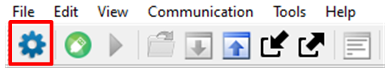

    5. Click **Connect** or select **Communication** > **Connect** to establish a connection.

        **Figure 3. Establish connection**

        

    6. Click **Start** or select **Communication** > **Start** to start data streaming from the device.

         **Figure 4. Start tuner communication**

         

         The **Widget/Sensor parameters** tab gets updated with the parameters configured in the **CAPSENSE&trade; Configurator** window. The tuner displays the data from the sensor in the **Widget View** and **Graph View** tabs.

    7. Set the **Read mode** to **Synchronized** mode. Navigate to the **Widget View** tab, and you can see the **LinerSlider0** widget highlighted in **blue** when you touch it.

         **Figure 5. Widget view of the CAPSENSE&trade; Tuner**

         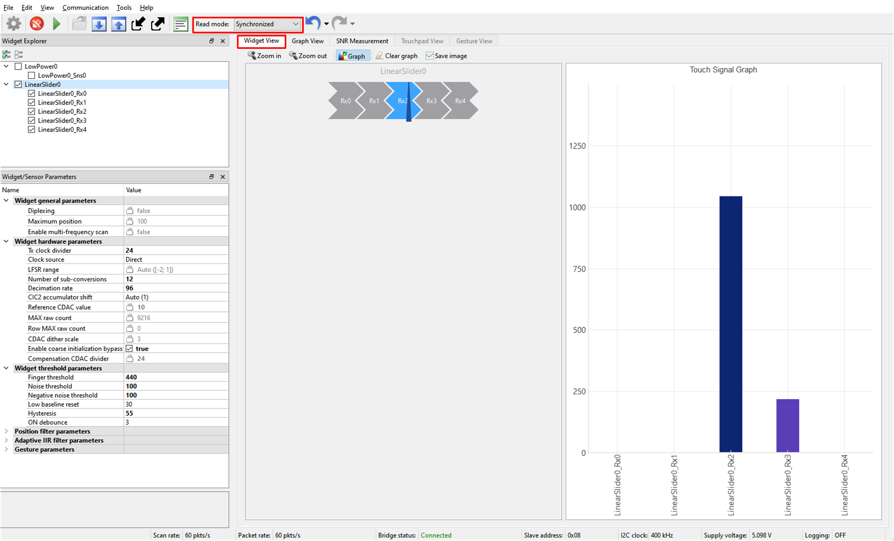

    8. You can view the raw count, baseline, difference count, and status for each sensor in the **Graph View** tab. For example, to view the sensor data for LinerSlider0, select **LinerSlider0_Rx0** under **LinerSlider0**.

       **Figure 6. Graph view for the CAPSENSE&trade; Tuner**

       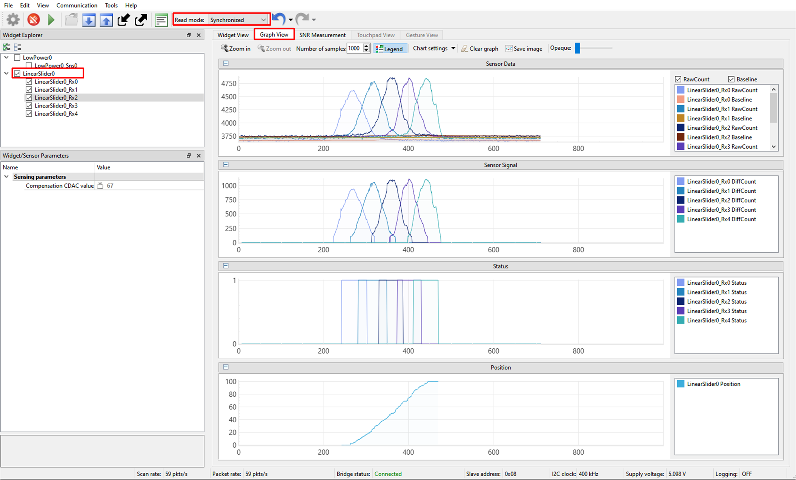

    9. Observe the **Widget/Sensor parameters** section in the CAPSENSE&trade; Tuner window as shown in **Figure 6**.
      
   10. Verify that the SNR is greater than 5:1 by following the steps given in [Stage 4: Obtain cross over point and noise](#stage-4-obtain-cross-over-point-and-noise)

Non-reporting of false touches and the linearity of the position graph indicate proper tuning.

</details>

<br>

## Operation at other voltages

[CY8CPROTO-040T kit](https://www.infineon.com/CY8CPROTO-040T) supports operating voltages of 1.8 V, 3.3 V, and 5 V. Refer to the [Kit user guide](www.infineon.com/002-38600) to set the preferred operating voltage and refer to section [setup the VDDA supply voltage and Debug mode](#set-up-the-vdda-supply-voltage-and-debug-mode-in-device-configurator).

This application functionalities are optimally tuned for 5 V. However, basic functionalities works on other voltages. 

For better performance, it is recommended to tune application for the preferred voltages.

## Measure current at different power modes

See the code example [CE238817](https://github.com/Infineon/mtb-example-psoc4-msclp-low-power-csd-button) that describes the steps of current measurement at different power modes.

**Table 1. Measured current for different modes**

Power mode | Refresh rate (Hz) | Current consumption (µA)
---------|-------------|-----------
Active    |128    | 114
Active Low Refresh rate <br>(ALR)  |32 | 30
Wake on Touch <br>(WoT)  |16 | 3.7

>**Note :** The above WoT current was measured on a kit having Deep Sleep current of 1.7 µA. If the kit has a Deep Sleep current of 2.5 µA (typical), the WoT current is expected to be ~4.4 µA.

## Tuning procedure

<details><summary><b> Create a custom BSP for your board </b></summary>

1. Create a custom BSP for your board having any device, by following the steps given in [ModusToolbox&trade; BSP Assistant user guide](https://www.infineon.com/ModusToolboxBSPAssistant). This code example was created for the device "CY8C4046LQI-T452".

2. Open the *design.modus* file from the *{Application root directory}/bsps/TARGET_APP_\<BSP-NAME>/config/* folder obtained in the previous step and enable CAPSENSE&trade; to get the *design.cycapsense* file. CAPSENSE&trade; configuration can then be started from scratch as explained below.


</details>

The following steps explain the tuning procedure. 

>**Note:** See the section "Selecting CAPSENSE&trade; hardware parameters" in the [PSoC&trade; 4 and PSoC&trade; 6 MCU CAPSENSE&trade; design guides](https://www.infineon.com/AN85951) to learn about the considerations for selecting each parameter value.

**Figure 7. CSX slider widget tuning flow**  

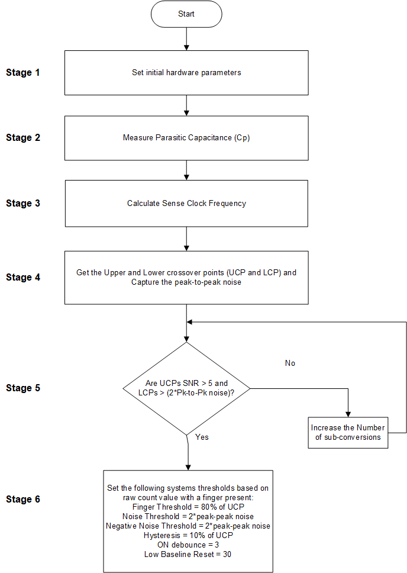

Do the following to tune the slider widget:

- [Stage 1: Set the initial hardware parameters](#stage-1-set-the-initial-hardware-parameters)

- [Stage 2: Measure Sensor Capacitance to set CDAC Dither parameter](#stage-2-measure-sensor-capacitance-to-set-cdac-dither-parameter)

- [Stage 3: Set the Sense clock frequency](#stage-3-set-the-sense-clock-frequency)

- [Stage 4: Obtain cross over point and noise](#stage-4-obtain-cross-over-point-and-noise)

- [Stage 5: Fine-tune sensitivity to achieve 5:1 SNR](#stage-5-fine-tune-sensitivity-to-achieve-51-snr)

- [Stage 6: Tune threshold parameters](#stage-6-tune-threshold-parameters)


### Stage 1: Set the initial hardware parameters
---------

1. Connect the board to your PC using the provided USB cable through the KitProg3 USB connector.
2. Launch the device configurator tool.

   You can launch the device configurator in Eclipse IDE for ModusToolbox&trade; software from the **Tools** section in the IDE **Quick Panel** or in standalone mode from *{ModusToolbox&trade; software install directory}/ModusToolbox/tools_{version}/device-configurator/device-configurator*. In this case, after opening the application, select **File** > **Open** and open the *design.modus* file of the respective application, which is present in the *{Application root directory}/bsps/TARGET_APP_\<BSP-NAME>/config/* folder.

3. In the [PSoC&trade; 4000T Prototyping](https://www.infineon.com/CY8CPROTO-040T) kit, the slider pin is connected to CAPSENSE&trade; channel (MSCLP 0). Therefore, make sure to enable CAPSENSE&trade; channel in the device configurator as shown in **Figure 8**.

   **Figure 8. Enable MSCLP channels in device configurator**

   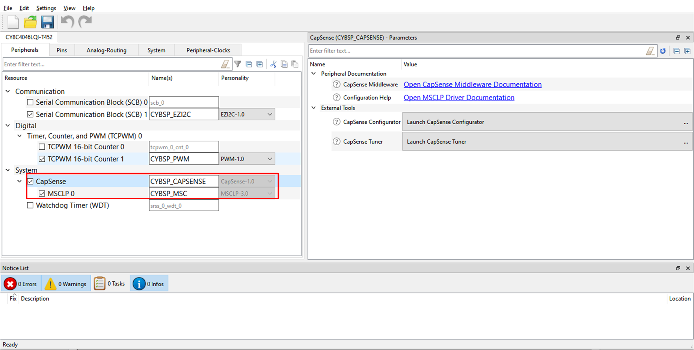

      Save the changes and close the window.

4. Launch the CAPSENSE&trade; configurator tool.
   
   You can launch the CAPSENSE&trade; configurator tool in Eclipse IDE for ModusToolbox&trade; software from the 'CAPSENSE&trade;' peripheral setting in the device configurator or directly from the **Tools** section in the IDE Quick Panel. You can also launch it in standalone mode from *{ModusToolbox&trade; software install directory}/ModusToolbox/tools_{version}/capsense-configurator/capsense-configurator*. In this case, after opening the application, select **File** > **Open** and open the *design.cycapsense* file of the respective application, which is present in the *{Application root directory}/bsps/TARGET_APP_\<BSP-NAME>/config/* folder.

   See the [ModusToolbox&trade; CAPSENSE&trade; configurator tool guide](https://www.infineon.com/ModusToolboxCapSenseConfig) for step-by-step instructions on how to configure and launch CAPSENSE&trade; in ModusToolbox&trade; software. 

5. In the **Basic** tab, note that the slider widget 'LinerSlider0' is configured as a CSX-RM (mutual-cap).

   **Figure 9. CAPSENSE&trade; configurator - Basic tab**

   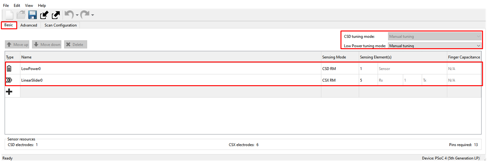

6. Do the following in the **General** tab under the **Advanced** tab:
   <ol type="A">
   <li>

   Select **CAPSENSE&trade; IMO Clock frequency** as **46 MHz**. 
   </li>

   <li>

   Set the **Modulator clock divider** to **1** to obtain the maximum available modulator clock frequency.
   </li>

   <li>

   Set the **Number of init sub-conversions** based on the hint shown when you hover over the edit box. Retain the default value.
   </li>

   <li>

   Use **Wake-on-Touch settings** to set the refresh rate and frame timeout while in the lowest power mode (Wake-on-Touch mode). Set **Wake-on-Touch scan interval (µs)** based on the required low-power state scan refresh rate. For example, to get a 16-Hz refresh rate, set the value to **62500**. 
   </li>


   <li>

   Set the **Number of frames in Wake-on-Touch** as the maximum number of frames to be scanned in WoT mode, if there is no touch detected. This determines the maximum time the device will be kept in the lowest-power mode if there is no user activity. Calculate the maximum time by multiplying this parameter with the **Wake-on-Touch scan interval (µs)** value.

   For example, to get 10 seconds as the maximum time in WoT mode, set the **Number of frames in Wake-on-Touch** to **160** for the  scan interval set as 62500 µs.

   >**Note:** For tuning low-power widgets, the **Number of frames in Wake-on-Touch** must be less than the  **Maximum number of raw counts in SRAM** based on the number of sensors in WoT mode as follows:

   **Table 2. Maximum number of raw counts in SRAM**

   Number of low <br> power widgets  | Maximum number of <br> raw counts in SRAM
      :---------------------| :-----
      1  | 245
      2  | 117
      3  | 74
      4  | 53
      5  | 40
      6  | 31
      7  | 25
      8  | 21
   
   **Figure 12. CAPSENSE&trade; Configurator - General settings**

   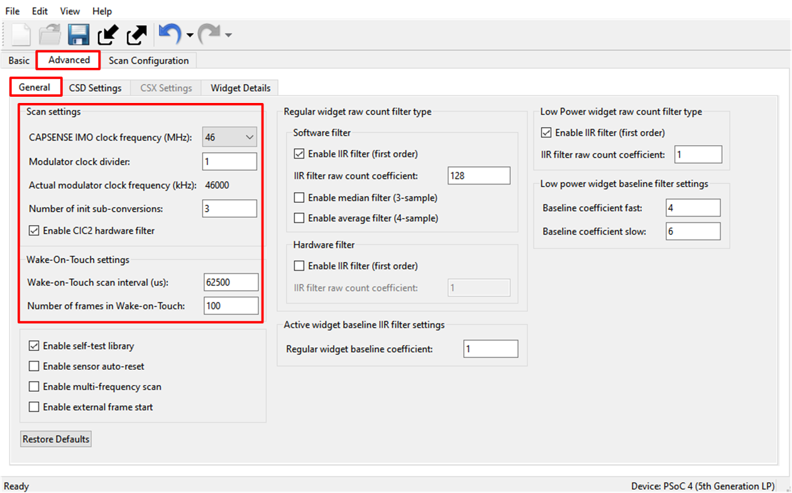

   </li>

   <li>

    Retain the default settings for all regular and low-power widget filters. You can enable or update the filters later depending on the SNR requirements in [Stage 4: Use CAPSENSE&trade; Tuner to fine tune for required SNR and refresh rate](#stage-4-use-capsense&trade;-tuner-to-fine-tune-for-required-snr-and-refresh-rate).

    Filters reduce the peak-to-peak noise, and using software filters results in a higher scan time.
   </li>


   </ol>

  > **Note:** Each tab has a **Restore Defaults** button to restore the parameters of that tab to their default values.

7. Go to the **CSD and CSX settings** tab and make the following changes:

   **Table 3. Maximum number of raw counts in SRAM**

   Parameters | CSD | CSX
     :---------|  :-------------|  :-----------  
   Inactive sensor connection | Shield | Ground
   Shield mode | Active |NA
   Total shield count  | 5 |NA
   Raw count calibration level | 65 | 40

   <ol type="A">
      <li>
    


      Select **Enable CDAC auto-calibration** and **Enable compensation CDAC**.

      This helps in achieving the required CDAC calibration levels (85% of maximum count by default) for all sensors in the widget, while maintaining the same sensitivity across the sensor elements.
      Set this to 65% for this application not to reach the saturation level on a touch event.
      </li>
      <li>

      Select **Enable CDAC dither**.

      This helps in removing flat spots, by adding white noise that moves the conversion point around the flat-spots region. Recommendations are explained in [Stage 2: Measure Sensor Capacitance to set CDAC Dither parameter](#stage-2-measure-sensor-capacitance-to-set-cdac-dither-parameter).


      </li>

   **Figure 11. CAPSENSE&trade; configurator - Advanced CSD settings**

   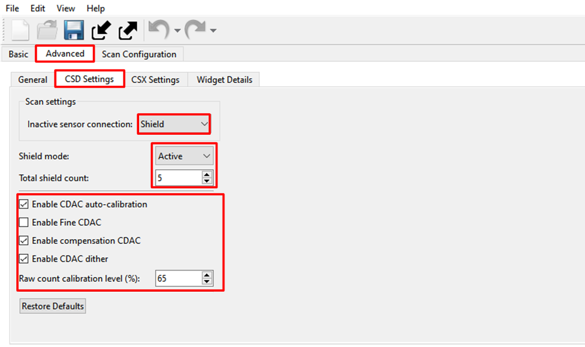
   

      **Figure 12. CAPSENSE&trade; configurator - Advanced CSX settings**

   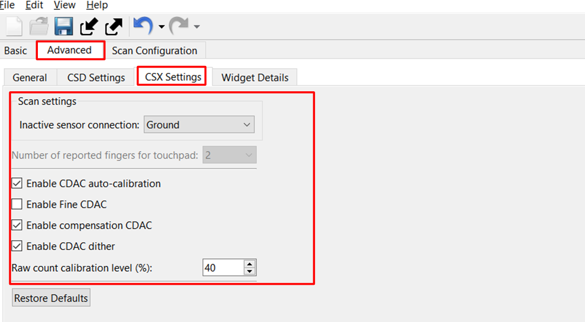


8. Go to the **Widget Details** tab. Select **LinerSlider0** from the left pane, and then set the following:

   - **Sense clock divider:** Retain default value (will be set in **Stage 3**)

   - **Clock source:** Direct

      **Note:** Spread spectrum clock (SSC) or PRS clock can be used as a clock source to deal with EMI/EMC issues.

   - **Number of sub-conversions:** 60

     '60' is a good starting point to ensure a fast scan time and sufficient signal. This value is adjusted as required in **Stage 5**. 

   - **Finger threshold:** 20

   - **Noise threshold:** 10

   - **Negative noise threshold:** 10

   - **Low-baseline reset:** 30

   - **Hysteresis:** 5

   - **ON debounce:** 3

      These values reduces the influence of baseline on the sensor signal, which helps to get the true difference-count. Retain the default values for the widget threshold parameters; these parameters are set in **Stage 5**.

   **Figure 13. CAPSENSE&trade; Configurator - Widget details tab under the Advanced tab**  
      
   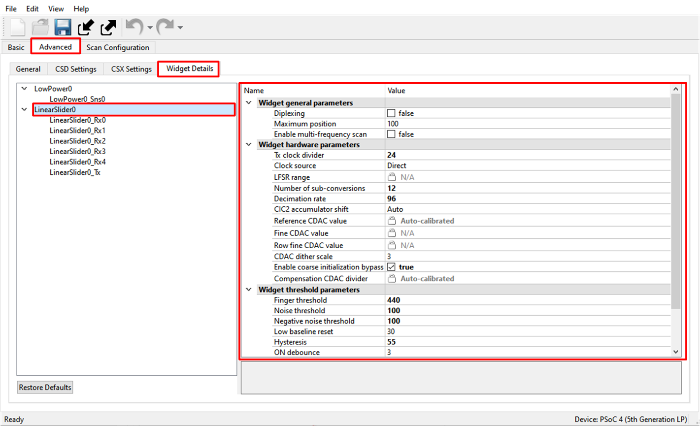

9. Go to the **Scan Configuration** tab to select the pins, the scan slots, and do the following:

   - Configure the pin for the electrode using the drop-down menu.

   - Configure the scan slot using the **Auto-Assign Slots** option or each sensor is allotted a scan slot based on the entered slot number. 

   - Check the notice list for warning or errors. 
   
   >   **Note:** Enable the **Notice List** in the **View** menu if it is not visible.

   **Figure 14. Scan configuration tab**

   

10. Click **Save** to apply the settings.

</details>

### Stage 2: Measure Sensor Capacitance to set CDAC Dither parameter
------------

The CAPSENSE&trade; middleware provides Built-In Self Test (BIST) API's to measure the capacitances of sensors configured in the application. The sensor capacitances are referred to as  **C<sub>p</sub>** for CSD sensors and **C<sub>m</sub>** for CSX sensors.

The steps to measure the C<sub>p</sub>/C<sub>m</sub> using BIST are as follows:

   1.	Open CAPSENSE&trade; Configurator from the **Quick 
   panel** and enable the BIST library.

   **Figure 15. Enabling self test library**
   
   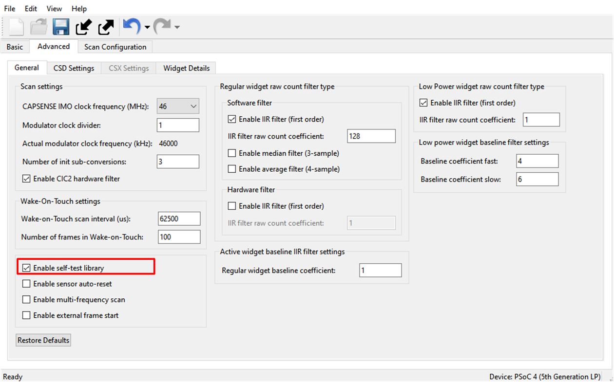

   2.	Get the capacitance(C<sub>p</sub>/C<sub>m</sub>) by following these steps:
        - Add breakpoint at the function call "measure_sensor_capacitance()" function in main.c
        - Run the application in debug mode

        > **Note:** Debug mode is disabled by default. To enable, see the [setup the VDDA supply voltage and Debug mode](#set-up-the-vdda-supply-voltage-and-debug-mode-in-device-configurator) section.
        
        - Click the **Step over** button once the break point hits
        - Add array variable sensor_capacitance to the **Expressions view** tab, which holds the measured Cp values of sensors configured

   **Figure 16. Measure C<sub>p</sub>/C<sub>m</sub> using BIST**

   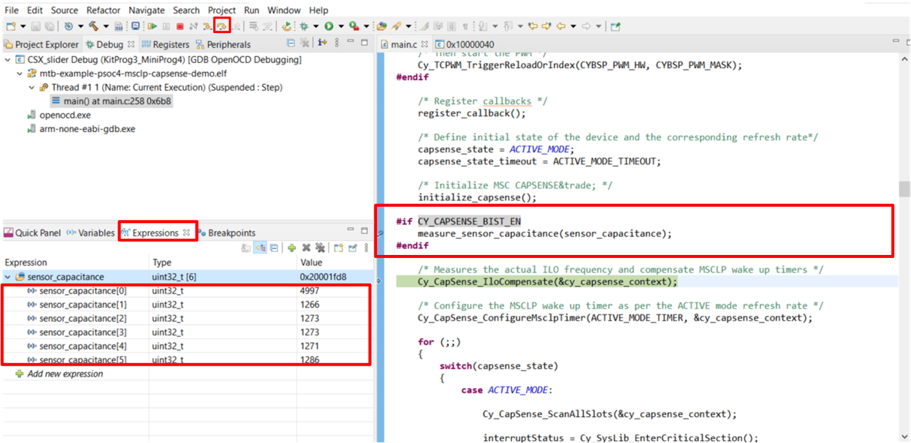

   4.	Index of sensor_capacitance array matches with the sensor configuration in CAPSENSE Configurator as shown in Figure 18.

   **Figure 17. Cp array index alignment**
   
   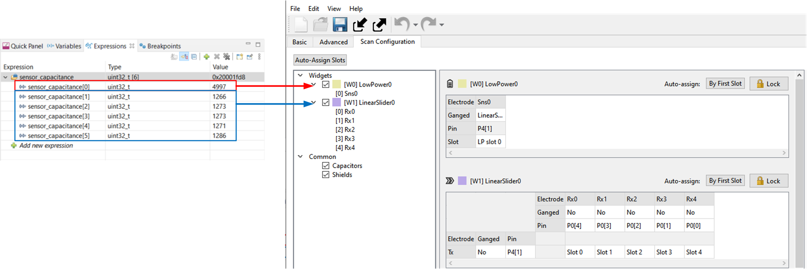

   3. Refer to [CAPSENSE&trade; library and documents](https://github.com/Infineon/capsense)  for more details about BIST.
   4. Keep this feature disabled in CAPSENSE&trade; Configurator if it is not used in the application.

**CDAC Dither scale setting**
<br>

MSCLP uses CDAC dithering to reduce flat spots. Select the optimal dither scale parameter based on the Sensor capacitance measured using the BIST library.

See the following table for general recommended values of the Dither scale.

**Table 4. Dither scale recommendation for CSD sensors**
 
Parasitic capacitance (C<sub>p</sub>) | Scale
:--- | :---:  
2pF <= C<sub>p</sub> < 3pF | 3
3pF <= C<sub>p</sub> < 5pF | 2
5pF <= C<sub>p</sub> < 10pF | 1
 C<sub>p</sub> >= 10pF  | 0

<br>

**Table 5. Dither scale recommendation for CSX sensors**
 
Mutual capacitance (C<sub>m</sub>) | Scale
:--- | :---:  
300fF <= C<sub>m</sub> < 500fF | 5
500fF <= C<sub>m</sub> < 1000fF | 4
1000fF <= C<sub>m</sub> < 2000fF | 3
C<sub>m</sub> >= 2pF  | Follow [Table 4](#Table-4.-Dither-Scale-Recommendation-for-CSD-Sensors)

 Set the Scale value in CAPSENSE&trade; Configurator as follows.

**Figure 18. CDAC Dither scale setting**

   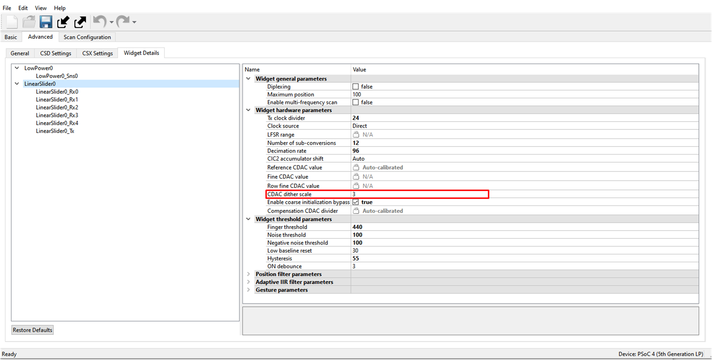
   </details>
   


### Stage 3: Set the sense clock frequency
-----------
The sense clock is derived from the Modulator clock using a clock-divider and is used to scan the sensor by driving the CAPSENSE&trade; switched capacitor circuits. Both the clock source and clock divider are configurable. The sense clock divider should be configured such that the pulse width of the sense clock is long enough to allow the sensor capacitance to charge and discharge completely. This is verified by observing the charging and discharging waveforms of the sensor, using an oscilloscope and an active probe. The sensors should be probed close to the electrode, and not at the sense pins or the series resistor. 

See [Figure 19](#figure-19-proper-charge-cycle-of-a-sensor) and [Figure 20](#figure-20-improper-charge-cycle-of-a-sensor) for waveforms observed on the shield. [Figure 19](#figure-19-proper-charge-cycle-of-a-sensor)  shows proper charging when sense clock frequency is correctly tuned. The pulse width is atleast 5Tau  i.e., the voltage is reaching atleast 99.3% of the required voltage at the end of each phase. [Figure 20](#figure-20-improper-charge-cycle-of-a-sensor) shows incomplete settling (charging/discharging).

**Figure 19. Proper charge cycle of a sensor**


**Figure 20. Improper charge cycle of a sensor**


1. Program the board and launch CAPSENSE&trade; Tuner.

2. Observe the charging waveform of the Sensor as described earlier. 

3. If the charging is incomplete, increase the Sense clock divider. Do this in CAPSENSE&trade; Tuner by selecting the sensor and editing the Sense clock divider parameter in the Widget/Sensor Parameters panel.

   >**Note:** The sense clock divider should be **divisible by 2**. This ensures that two scan phases have equal durations. 

   After editing the value, click the **Apply to Device** button and observe the waveform again. Repeat this until complete settling is observed.  
   
4. Click the **Apply to Project** button to save the configuration to your project. 

   **Figure 21. Sense Clock Divider setting**

   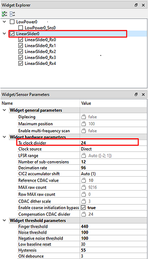
   

5. Repeat this process for all the Sensors and the Shield. Each sensor may require a different sense clock divider value to charge/discharge completely. But all the sensors that are in the same scan slot should have the same sense clock source, sense clock divider, and number of sub-conversions. Therefore, take the largest sense clock divider in a given scan slot and apply it to all the other sensors that share the slot.


</details>

### Stage 4: Obtain cross-over point and noise
-----------

1. Program the board.

2. Launch the CAPSENSE&trade; Tuner to monitor the CAPSENSE&trade; data, tuning CAPSENSE&trade; parameter, and SNR measurement.

   See the [CAPSENSE&trade; Tuner guide](https://www.infineon.com/ModusToolboxCapSenseTune) for step-by-step instructions on how to launch and configure the CAPSENSE&trade; Tuner in ModusToolbox&trade; software.

3. Capture and note the peak-to-peak noise of each segment of the slider.

i. From the **Widget Explorer** section, select a sensor (for example, LinearSlider0_Sns0).

ii. Go to the **SNR Measurement** tab and click **Acquire Noise** to capture peak-to-peak noise as shown in **Figure 22** .

**Figure 22. Noise obtained on the SNR Measurement tab in Tuner window**

   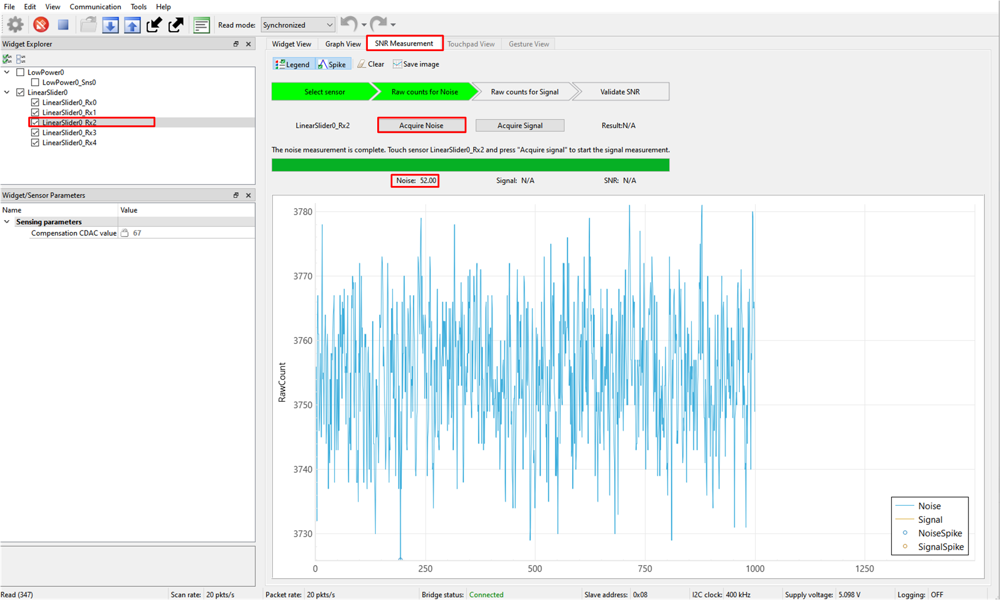

iii. Repeat Steps 1 and 2 for all the sensors to capture peak-to-peak noise.

**Table 6. Peak-to-peak noise obtained for each segment**

Slider segment | Peak-to-peak noise (CY8CPROTO-040T)
:---: | :---:  
SNS0  | 38
SNS1  | 39
SNS2  | 52
SNS3  | 40
SNS4  | 40

4. Use a grounded metal finger (typically 6 mm ) and swipe it slowly at a constant speed from the start to the end of the slider.

i. Go to the **Graph View** tab to view a graph similar to **Figure 24**

ii. Get the upper crossover point (UCP) and lower crossover point (LCP) as shown in **Figure 23**.

**Figure 23. Difference count (delta) vs. finger position**


Sensor signal values at points a, b, c, and d are expected to be at approximately the same level. If the values are slightly different, consider the lowest value as the UCP.

Sensor signal values at points q, r, and s are expected to be at approximately the same level. If the values are slightly different, consider the lowest value as the LCP.

**Figure 24. Difference count (delta) vs. finger position**

   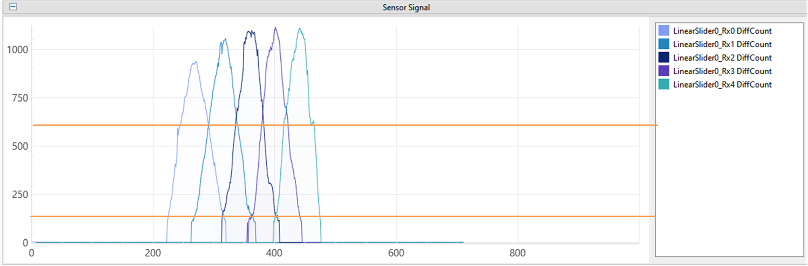


### Stage 5: Fine-tune sensitivity to achieve 5:1 SNR
------------

To ensure reliable operation, the sensor should be tuned to have a minimum SNR of 5:1 and a minimum Signal of 50 . The sensitivity can be increased by increasing number of sub-conversions and noise can be decreased by enabling filters. 

The steps for optimizing these parameters are as follows:

1. Measure the SNR as mentioned in the [Obtain cross-over point and noise](#Obtain cross-over point and noise) section.

2. If the SNR is less than 5:1, increase the number of sub-conversions.  Edit the number of sub-conversions (N<sub>sub</sub>) directly in the **Widget/Sensor parameters** tab of the CAPSENSE&trade; Tuner.

      >**Note:** Number of sub-conversion should be greater than or equal to 8.

3.  Calculate the decimation rate using **Equation 1**. The resolution increases with an increase in the decimation rate; therefore, set the maximum decimation rate indicated by the equation.

      **Equation 1. Decimation rate**

      

4.  Load the parameters to the device and measure SNR as mentioned in Steps 3 and 4 in the [Obtain cross-over point and noise](#Obtain cross-over point and noise) section. 
   
      Repeat steps 1 to 4 until the following conditions are met:
      - Measured SNR from the previous stage is greater than 5:1
      - Signal count is greater than 50

5. If the system is very noisy (>40% of Signal), enable filters.

   This example has the CIC2 filter enabled, which increases the resolution for the same scan time. See [AN234231 - Achieving lowest-power capacitive sensing with PSoC&trade; 4000T](https://www.infineon.com/AN234231) for detailed information on the CIC2 filter. Whenever CIC2 filter is enabled, it is recommended to enable the IIR filter for optimal noise reduction. Therefore, this example has the IIR filter enabled as well.
   <ol type="A">
   <li>

   Open **CAPSENSE&trade; Configurator** from ModusToolbox&trade; **Quick Panel** and select the appropriate filter:

   **Figure 25. Filter settings in CAPSENSE&trade; Configurator**

   
   </li>
   <li>

   Enable the filter based on the type of noise in your system. See [AN85951 – PSoC&trade; 4 and PSoC&trade; 6 MCU CAPSENSE&trade; design guide](https://www.infineon.com/AN85951) for more details.
   </li>
   <li>

   Click **Save** and close CAPSENSE&trade; Configurator. Program the device to update the filter settings.
   </li>

   >**Note** : Increasing number of sub-conversions and enabling filters will increase the scan time which in turn decreasing the responsiveness of the Sensor. Increase in scan time also increases the power consumption. Therefore, the number of sub-conversions and filter configuration must be optimized to achieve a balance between SNR, power, and refresh rate. 

</details>

### Stage 6: Tune threshold parameters
-----------

After confirming that your design meets the timing parameters and the SNR is greater than 5:1, set your threshold parameters as follows:

1. Set the recommended threshold values for the Slider widget using the LCP and UCP obtained in **Stage 5**:

   - **Finger threshold =** 80% of UCP

   - **Noise threshold =** twice the peak-to-peak noise

   - **Negative noise threshold =** twice the peak-to-peak noise

   - **Hysteresis =** 10% of UCP

   - **Debounce =** Default value of 3

2. Set the threshold parameters in the **Widget/Sensor Parameters** section of the CAPSENSE&trade; Tuner:

   **Figure 26. Widget threshold parameters**

   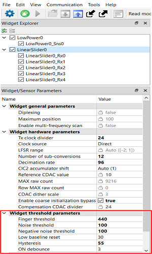

3. Click **Apply to Device** to apply the settings to the device and to the project.

   **Figure 27. Apply settings to device**

   
   
   After applying the configuration, test the performance by touching the slider. If your sensor is tuned correctly, you will observe the touch status go from 0 to 1 in the **Status** panel of the **Graph View** tab as shown in Figure 27. The status of the slider is also indicated by  LED2 in the kit; LED2 turns ON when the finger touches the slider and turns OFF when the finger is removed.


   **Figure 27. Sensor status in CAPSENSE&trade; Tuner**

   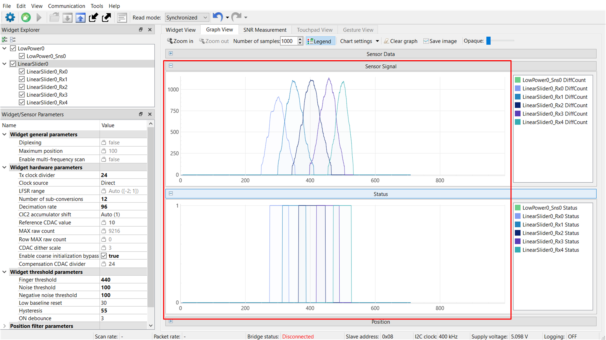

4. Click **Apply to Project** as shown in Figure 28. The change is updated in the *design.cycapsense* file. Close **CAPSENSE&trade; Tuner** and launch **CAPSENSE&trade; Configurator**. You should see all the changes made in the CAPSENSE&trade; Tuner are reflected in the **CAPSENSE&trade; Configurator**.

    **Figure 29. Apply settings to Project**

   

   
   **Table 7. Software tuning parameters obtained based on sense for [CY8CPROTO-040T](https://www.infineon.com/CY8CPROTO-040T)** 
  
   |Parameter|	CY8CPROTO-040T |
   |:--------|:------|
   |Signal	|550	|
   |Finger threshold 	|440|
   |Noise threshold |100|
   |Negative noise threshold	|100|
   |Hysteresis	| 55 |
   |ON debounce	|3|
   |Low baseline reset	|30| 

###  **Process time measurement**
--------------------


To set the optimum refresh rate of each power mode, measure the process time of the application.

Perform the following steps to measure the process time of the blocks in the application code while excluding the scan time:

1. Enable ENABLE_RUN_TIME_MEASUREMENT macro in *main.c* as follows:
      
      ```
      #define ENABLE_RUN_TIME_MEASUREMENT (1u)
      ```     
      This macro enables the System tick configuration and runtime measurement functionalities. 

2.	Place the start_runtime_measurement() function call before the application code and the stop_runtime_measurement() function call after it. The stop_runtime_measurement() function will return the execution time in microseconds(µs). 
 
      ```   
         #if ENABLE_RUN_TIME_MEASUREMENT
            uint32_t run_time = 0;
            start_runtime_measurement();
         #endif

         /* User Application Code Start */
         .
         .
         .
         /* User Application Code Stop */

         #if ENABLE_RUN_TIME_MEASUREMENT
            run_time = stop_runtime_measurement();
         #endif
      ```

3.	Run the application in debug mode with breakpoints placed at the active_processing_time and alr_processing_time variables as follows:
      ```
         #if ENABLE_RUN_TIME_MEASUREMENT
            active_processing_time=stop_runtime_measurement();
         #endif
         and 
         #if ENABLE_RUN_TIME_MEASUREMENT
            alr_processing_time=stop_runtime_measurement();
         #endif
      ``` 
4. Read the variables by adding them into **Expressions view** tab.
5. Update related macros with earlier measured processing times in *main.c* as follows:
      ```
      #define ACTIVE_MODE_PROCESS_TIME     (xx)

      #define ALR_MODE_PROCESS_TIME        (xx)
      ```
### **Scan time Measurement**
--------------------
Scan time is necessary to calculate the refresh rate of the application power modes. The total scan time of all the widgets in this code example is  49 µs.

The scan time can be calculated as follows:

The scan time includes the MSCLP initialization time, Cmod, and the total sub-conversions of the sensor. 

To control the Cmod initialization sequence, set the "Enable Coarse initialization bypass" configurator option as listed in the following table:

Enable coarse initialization bypass | Behaviour
:-------------|:---------
TRUE|Cmod initialization happens only once before scanning the sensors of the widget
FALSE| Cmod initialization happens before scanning each sensor of the widget

Use the following equations to measure the widgets scan time based on coarse initialization bypass options selected: 

**Equation 2. Scan time calculation of a widget with coarse initialization bypass enabled**


**Equation 3. Scan time calculation of a widget with coarse initialization bypass disabled**


-----------------
where,

**n** - Total sensors of the widget

**SubConv<sub>total</sub>** - Total sub conversions count includes number of init and actual sub-conversions.

**SnsClkDiv** - Sense clock divider

**F<sub>mod</sub>** - Modulator clock frequency

**k** - Measured Initialization time (MSCLP+Cmod).

-----------------

This value of **k** measured for this application is ~10 µs. It remains constant for all widgets. 

**k** can be measured using oscilloscope, as shown in the following figure:

**Figure 30. k value measurement**


Update the following macros in *main.c* using the calculated scan time. For this application, the value remains the same for both macros.

```
#define ACTIVE_MODE_FRAME_SCAN_TIME     (xx)

#define ALR_MODE_FRAME_SCAN_TIME        (xx)
```


> **Note :** If the application has more than one widget, add the scan time of individual widgets calculated.

</details>

<br>


## Debugging

You can debug this project to step through the code. In the Eclipse IDE for ModusToolbox, use the **\<Application Name> Debug (KitProg3_MiniProg4)** configuration in the **Quick Panel**. For details, see the "Program and debug" section in the [Eclipse IDE for ModusToolbox&trade; software user guide](https://www.infineon.com/MTBEclipseIDEUserGuide).

By default, the debug option is disabled in the device configurator. To enable the debug option, see the [Setup VDD and Debug mode](#set-up-the-vdda-supply-voltage-and-debug-mode-in-device-configurator) section. To achieve low power consumption, it is recommended to disable it. 

<details><summary><b>In other IDEs</b></summary>

Follow the instructions in your preferred IDE.
</details>

## Design and implementation

The project contains a slider widget configured in CSX-RM sensing mode. See the [Tuning procedure](#tuning-procedure) section for step-by-step instructions to configure the other settings of the **CAPSENSE&trade; Configurator**.

The project uses the [CAPSENSE&trade; middleware](https://github.com/Infineon/capsense) (see ModusToolbox&trade; user guide for more details on selecting a middleware). See [AN85951 - PSoC&trade; 4 and PSoC&trade; 6 MCU CAPSENSE&trade; design guide](https://www.infineon.com/dgdl/Infineon-AN85951_PSoC_4_and_PSoC_6_MCU_CapSense_Design_Guide-ApplicationNotes-v27_00-EN.pdf?fileId=8ac78c8c7cdc391c017d0723535d4661) for more details on CAPSENSE&trade; features and usage.

The [ModusToolbox&trade; software](https://www.infineon.com/cms/en/design-support/tools/sdk/modustoolbox-software) provides a GUI-based tuner application for debugging and tuning the CAPSENSE&trade; system. The *CAPSENSE&trade; Tuner* application works with EZI2C and UART communication interfaces. This project has an SCB block configured in EZI2C mode to establish communication with the on-board KitProg, which in turn enables reading the CAPSENSE&trade; raw data by the CAPSENSE&trade; tuner. See [EZI2C - Peripheral settings](#resources-and-settings).

The CAPSENSE&trade; data structure that contains the CAPSENSE&trade; raw data is exposed to the CAPSENSE&trade; tuner by setting up the I2C communication data buffer with the CAPSENSE&trade; data structure. This enables the tuner to access the CAPSENSE&trade; raw data for tuning and debugging CAPSENSE&trade;.

The successful tuning of the slider is indicated by an LED in the Prototyping Kit; the LED2 is turned ON when the finger touches the slider and turned OFF when the finger is removed from the slider.

### Set up the VDDA supply voltage and debug mode in Device Configurator

1. Open Device configurator from the **Quick Panel**. 

2. Go to the **System** tab. Select the **Power** resource, and set the VDDA value under **Operating Conditions** as shown in **Figure 31**. 

   **Figure 31. Setting the VDDA supply in the system tab of device configurator**

   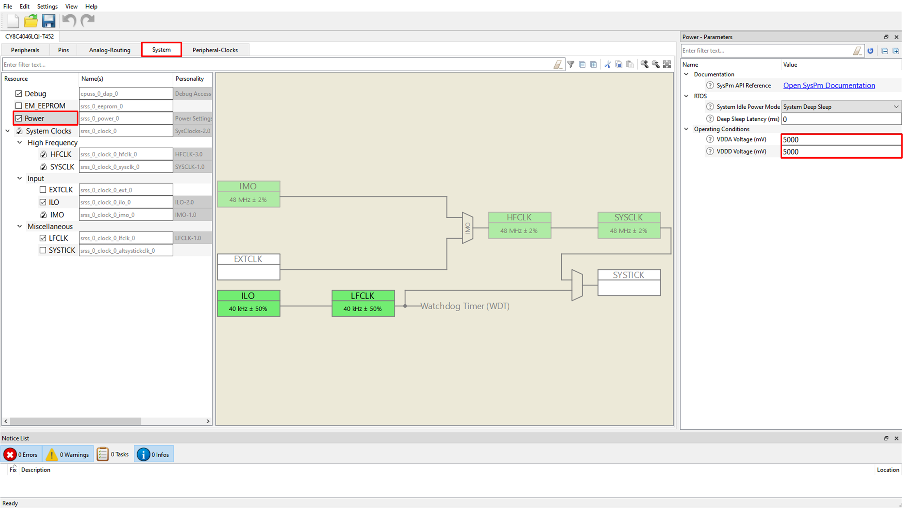 

3. By default, the debug mode is disabled for this application to reduce power consumption. Enable the debug mode to enable the SWD pins as follows:

   **Figure 32. Enable debug mode in the System tab of Device Configurator**

   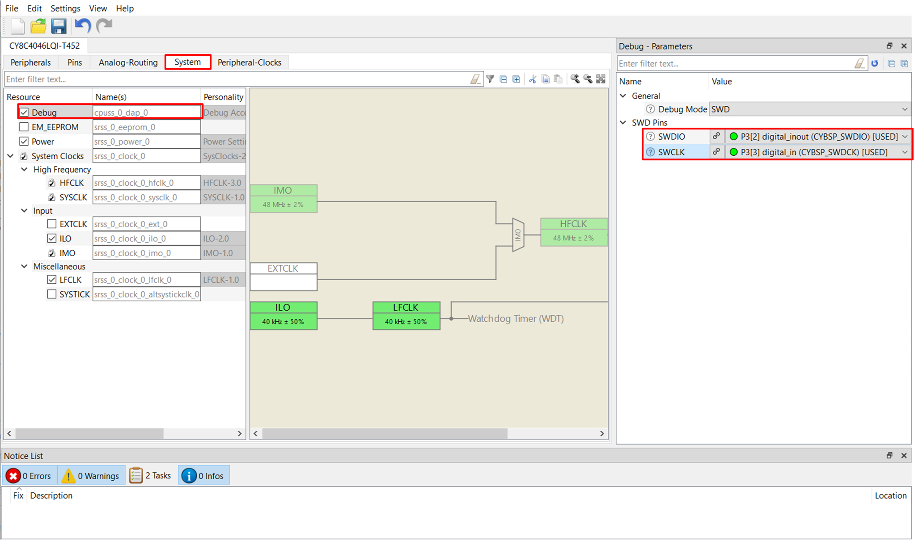


### Resources and settings

**Figure 33. EZI2C settings**

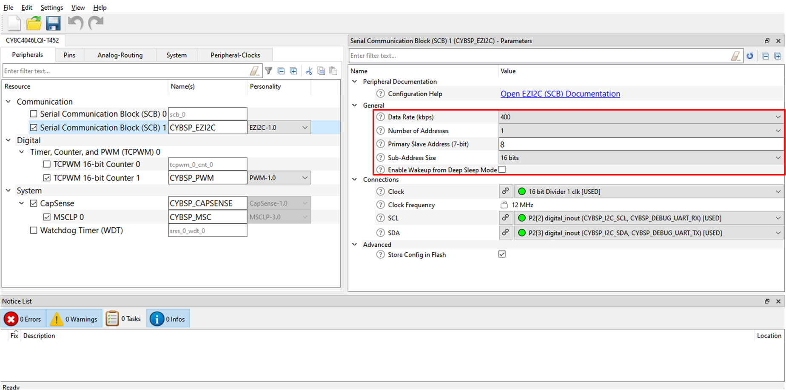

**Table 8. Application resources**

| Resource  |  Alias/object     |    Purpose     |
| :------- | :------------    | :------------ |
| SCB (EZI2C) (PDL) | CYBSP_EZI2C          | EZI2C slave driver to communicate with CAPSENSE&trade; tuner |
| CAPSENSE&trade; | CYBSP_MSC | CAPSENSE&trade; driver to interact with the MSCLP hardware and interface the CAPSENSE&trade; sensors |
| Digital pin     | CYBSP_USER_LED2, CYBSP_USER_BTN | To show the slider operation|

</details> 

<br>

### Firmware flow

**Figure 34. Firmware flowchart**


<br>

## Related resources

Resources  | Links
-----------|----------------------------------
Application notes  | [AN79953](https://www.infineon.com/AN79953) - Getting started with PSoC&trade; 4 <br> [AN85951](https://www.infineon.com/AN85951) - PSoC&trade; 4 and PSoC&trade; 6 MCU CAPSENSE&trade; design guide <br> [AN234231](https://www.infineon.com/AN234231) - Achieving lowest-power capacitive sensing with PSoC&trade; 4000T
Code examples | [Using ModusToolbox&trade; software](https://github.com/Infineon/Code-Examples-for-ModusToolbox-Software) on GitHub
Device documentation | [PSoC&trade; 4 datasheets](https://www.infineon.com/cms/en/search.html?intc=searchkwr-return#!view=downloads&term=psoc%204&doc_group=Data%20Sheet) <br>[PSoC&trade; 4 technical reference manuals](https://www.infineon.com/cms/en/search.html#!term=psoc%204%20technical%20reference%20manual&view=all)
Development kits | Select your kits from the [Evaluation board finder](https://www.infineon.com/cms/en/design-support/finder-selection-tools/product-finder/evaluation-board).
Libraries on GitHub  | [mtb-hal-cat2](https://github.com/Infineon/mtb-hal-cat2) - Hardware Abstraction Layer (HAL) library
Middleware on GitHub | [capsense](https://github.com/Infineon/capsense) - CAPSENSE&trade; library and documents <br>
Tools  | [ModusToolbox&trade;](https://www.infineon.com/modustoolbox) – ModusToolbox&trade; software is a collection of easy-to-use libraries and tools enabling rapid development with Infineon MCUs for applications ranging from wireless and cloud-connected systems, edge AI/ML, embedded sense and control, to wired USB connectivity using PSoC&trade; Industrial/IoT MCUs, AIROC&trade; Wi-Fi and Bluetooth&reg; connectivity devices, XMC&trade; Industrial MCUs, and EZ-USB&trade;/EZ-PD&trade; wired connectivity controllers. ModusToolbox&trade; incorporates a comprehensive set of BSPs, HAL, libraries, configuration tools, and provides support for industry-standard IDEs to fast-track your embedded application development.

<br>

## Other resources

Infineon provides a wealth of data at [www.infineon.com](https://www.infineon.com) to help you select the right device, and quickly and effectively integrate it into your design.

## Document history

Document title: *CE238819* - *PSoC&trade; 4: MSCLP low power CSX slider tuning*

 Version | Description of change
 ------- | ---------------------
 1.0.0   | New code example.

<br>

---------------------------------------------------------

© Cypress Semiconductor Corporation, 2023. This document is the property of Cypress Semiconductor Corporation, an Infineon Technologies company, and its affiliates ("Cypress").  This document, including any software or firmware included or referenced in this document ("Software"), is owned by Cypress under the intellectual property laws and treaties of the United States and other countries worldwide.  Cypress reserves all rights under such laws and treaties and does not, except as specifically stated in this paragraph, grant any license under its patents, copyrights, trademarks, or other intellectual property rights.  If the Software is not accompanied by a license agreement and you do not otherwise have a written agreement with Cypress governing the use of the Software, then Cypress hereby grants you a personal, non-exclusive, nontransferable license (without the right to sublicense) (1) under its copyright rights in the Software (a) for Software provided in source code form, to modify and reproduce the Software solely for use with Cypress hardware products, only internally within your organization, and (b) to distribute the Software in binary code form externally to end users (either directly or indirectly through resellers and distributors), solely for use on Cypress hardware product units, and (2) under those claims of Cypress's patents that are infringed by the Software (as provided by Cypress, unmodified) to make, use, distribute, and import the Software solely for use with Cypress hardware products.  Any other use, reproduction, modification, translation, or compilation of the Software is prohibited.
<br>
TO THE EXTENT PERMITTED BY APPLICABLE LAW, CYPRESS MAKES NO WARRANTY OF ANY KIND, EXPRESS OR IMPLIED, WITH REGARD TO THIS DOCUMENT OR ANY SOFTWARE OR ACCOMPANYING HARDWARE, INCLUDING, BUT NOT LIMITED TO, THE IMPLIED WARRANTIES OF MERCHANTABILITY AND FITNESS FOR A PARTICULAR PURPOSE.  No computing device can be absolutely secure.  Therefore, despite security measures implemented in Cypress hardware or software products, Cypress shall have no liability arising out of any security breach, such as unauthorized access to or use of a Cypress product. CYPRESS DOES NOT REPRESENT, WARRANT, OR GUARANTEE THAT CYPRESS PRODUCTS, OR SYSTEMS CREATED USING CYPRESS PRODUCTS, WILL BE FREE FROM CORRUPTION, ATTACK, VIRUSES, INTERFERENCE, HACKING, DATA LOSS OR THEFT, OR OTHER SECURITY INTRUSION (collectively, "Security Breach").  Cypress disclaims any liability relating to any Security Breach, and you shall and hereby do release Cypress from any claim, damage, or other liability arising from any Security Breach.  In addition, the products described in these materials may contain design defects or errors known as errata which may cause the product to deviate from published specifications. To the extent permitted by applicable law, Cypress reserves the right to make changes to this document without further notice. Cypress does not assume any liability arising out of the application or use of any product or circuit described in this document. Any information provided in this document, including any sample design information or programming code, is provided only for reference purposes.  It is the responsibility of the user of this document to properly design, program, and test the functionality and safety of any application made of this information and any resulting product.  "High-Risk Device" means any device or system whose failure could cause personal injury, death, or property damage.  Examples of High-Risk Devices are weapons, nuclear installations, surgical implants, and other medical devices.  "Critical Component" means any component of a High-Risk Device whose failure to perform can be reasonably expected to cause, directly or indirectly, the failure of the High-Risk Device, or to affect its safety or effectiveness.  Cypress is not liable, in whole or in part, and you shall and hereby do release Cypress from any claim, damage, or other liability arising from any use of a Cypress product as a Critical Component in a High-Risk Device. You shall indemnify and hold Cypress, including its affiliates, and its directors, officers, employees, agents, distributors, and assigns harmless from and against all claims, costs, damages, and expenses, arising out of any claim, including claims for product liability, personal injury or death, or property damage arising from any use of a Cypress product as a Critical Component in a High-Risk Device. Cypress products are not intended or authorized for use as a Critical Component in any High-Risk Device except to the limited extent that (i) Cypress's published data sheet for the product explicitly states Cypress has qualified the product for use in a specific High-Risk Device, or (ii) Cypress has given you advance written authorization to use the product as a Critical Component in the specific High-Risk Device and you have signed a separate indemnification agreement.
<br>
Cypress, the Cypress logo, and combinations thereof, ModusToolbox, PSoC, CAPSENSE, EZ-USB, F-RAM, and TRAVEO are trademarks or registered trademarks of Cypress or a subsidiary of Cypress in the United States or in other countries. For a more complete list of Cypress trademarks, visit www.infineon.com. Other names and brands may be claimed as property of their respective owners.
